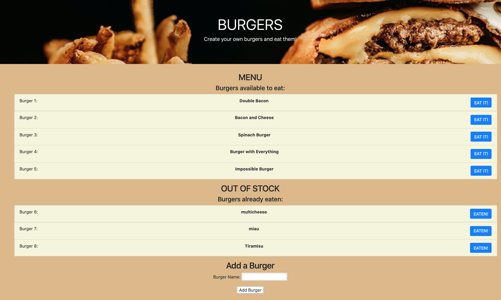

# Log and Eat Burgers

Virtually!. Create your own burgers and eat them!.

This restaurant app allows users to input the names of burgers they'd like to eat.

The user can submit a burger name and the app will display the burger on the restaurant menu page.

Each burger in the menu has a `Eat it!` button. When the user clicks the button, the burger will move below to the eaten side the page.

The app stores every burger in the MySQL database, whether it is eaten or not.

### App Screenshot



### Deployed Heroku URL 


### Github Repository URL

[Log and Eat Burgers - GitHub Repo](https://github.com/tomaspz/log-and-eat-burgers)

### Updated Portfolio


### Overview

This application is a burger logger using the following software: 
* [MySQL Community Server](https://dev.mysql.com/downloads/mysql/), 
* [MySQL Workbench](https://dev.mysql.com/downloads/workbench/),
* [Node](https://nodejs.org/en/), 
* Node NPM Packages:
    * [Express](https://www.npmjs.com/package/express) (acts as a web server, routing data from the front-end to the database and viceversa), 
    * [Express Handlebars](https://www.npmjs.com/package/express-handlebars) (generates the HTML with its templating engine)
    * [MySQL NPM Package](https://www.npmjs.com/package/mysql) (database where CRUD - [Create Read Update Delete](https://en.wikipedia.org/wiki/Create,_read,_update_and_delete) - queries are done for persistent storage)
* a simple and handmade __O.R.M__ ([Object-Realtional Mapping](https://en.wikipedia.org/wiki/Object-relational_mapping)). 
* the software follows the __M.V.C__ ([Model-View-Controller](https://en.wikipedia.org/wiki/Model%E2%80%93view%E2%80%93controller)) design pattern.


### MySQL Heroku Deployment Guide

[MYSQL Heroku Deployment Guide](../../04-Supplemental/MySQLHerokuDeploymentProcess.pdf) 


### App Video Example

[YouTube App - How it works](https://youtu.be/msvdn95x9OM).

### Instructions

#### App Setup

1. Create a GitHub repo and clone it to your computer.

2. Create the `server.js` file.

3. Run `npm init -y` to create the `package.json` file.

3. Run `npm i express express-handlebars mysql` to install the 3 npm packages.

4. Inside the `server.js` file type: `const express = require('express');` 

#### DB Setup

1. Inside the root directory, create a folder named `db`.

2. In the `db` folder, create a file named `schema.sql`. Type the following inside the `schema.sql` file:

```
DROP DATABASE OF EXISTS burguers_db;
CREATE DATABASE burguers_db;
USE burguers_db;

CREATE TABLE burgers(
    id INT AUTO_INCREMENT NOT NULL,
    burger_name VARCHAR(50) NOT NULL,
    devoured BOOLEAN DEFAULT false
    PRIMARY KEY(id)
);
```
3. Inside the `db` folder, create the `seeds.sql` file and populate the fields with information.

```
INSERT INTO burgers (burger_name, devoured) 
VALUES ('Double Bacon', false), 
        ('Bacon and Cheese', false),
        ('Spinach Burger', false),
        ('Burger with Everything', false),
        ('Impossible Burger', false);
```
4. Run the `schema.sql` and `seeds.sql` files in the MySQL Workbench. Also, you can do it from the command line:

    * change directory to the `db` folder.
    * run `mysql -u root -p`.
    * you should see the `mysql>` command line
    * run `mysql> source schema.sql`
    * run `mysql>source seeds.sql`.
    * type `mysql> exit`.

#### Config Setup

1. At the root directory, create a folder named `config`.

2. Inside the `config` folder, create: 
* `connection.js` file. Set the code to connect Node to MySQL and export the connection.
* `orm.js` file. Require `connection.js` into `orm.js`. Create methods to retrieve and store data in the database and to execute MySQL commands in the controllers. Export the ORM object.

     * `selectAll()`
     * `insertOne()`
     * `updateOne()`

#### Model Setup

* At the root directory, create a folder named `models` and inside create the `burger.js` file.
In this file import `orm.js`. Create the code to call the ORM functions using burger specific input for the ORM. Export the object at the end.

#### Controller Setup

* At the root directory, create a folder named `controllers` with the `burgers_controller.js` file inside. In this file, import `express` and `burger.js`

* Create the `router` for the app, and export the `router` at the end of your file.

#### View Setup

* At the root directory, create a folder named `views` with the `index.handlebars` file inside.

* Inside `views` directory, create the `layouts` directory with the `main.handlebars` file inside.

* Set `main.handlebars` to be used by Handlebars.

* Setup the `index.handlebars` to have the template that Handlebars can render onto. Create a button to submit the user input into the database.

#### Directory Structure

All the recommended files and directories from the steps above should look like the following structure:

```
.
├── config
│   ├── connection.js
│   └── orm.js
│ 
├── controllers
│   └── burgers_controller.js
│
├── db
│   ├── schema.sql
│   └── seeds.sql
│
├── models
│   └── burger.js
│ 
├── node_modules
│ 
├── package.json
│
├── public
│   └── assets
│       ├── css
│       │   └── burger_style.css
│       └── img
│           └── burger.png
│   
│
├── server.js
│
└── views
    ├── index.handlebars
    └── layouts
        └── main.handlebars
```